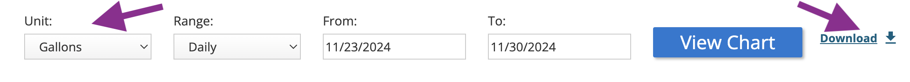

# Utilities

Both the Philadelphia energy utility (PECO) and Philadelphia Water Department
(PWD) websites each allow for a residential account holder access to their own
account usage data.

- PECO provides the amount of electricity used each hour in kilowatt-hours (kWh).
- PWD provides the amount of water used each day in gallons.

Each website provides uniquely-formatted data in "comma-separated values" (CSV)
file format, as detailed below.

---

## Electric
The export file from PECO is named based upon the dates exported, similarly to:
`peco_electric_usage_interval_data_Service 1_1_2023-07-04_to_2023-07-04.csv`

### Example
The electricity usage CSV file from PECO begins with a header that includes
account information:
> ```
> Name,WILLIAM PENN
> Address,"1 S BROAD ST, PHILADELPHIA PA 19112"
> Account Number,1776xxxxxx
> Service,Service 1
> ```

Each row of the file includes kilowatt-hours (kWh) of electricity used per hour:
> ```
> TYPE,DATE,START TIME,END TIME,USAGE (kWh),NOTES
> Electric usage,2023-07-04,00:00,00:59,0.29
> Electric usage,2023-07-04,01:00,01:59,0.34
> Electric usage,2023-07-04,02:00,02:59,0.34
> Electric usage,2023-07-04,03:00,03:59,0.32
> ```

---

## Water
A CSV can be downloaded by "Gallons" of water used "Daily" from the
"[Detailed Usage](https://secure8.i-doxs.net/CityOfPhiladelphiaWRB/Secure/Usage.aspx)"
section of the Philadelphia Water Department (PWD) website.

### Example


The water usage export file is named `ChartData.csv` and each row of the file
includes gallons of water used per hour:
```
Access Code, Time Interval, Consumption, Units
00145xxxx, 11/27/2024, 18.7013, Gallons
00145xxxx, 11/28/2024, 35.9065, Gallons
00145xxxx, 11/29/2024, 35.1584, Gallons
00145xxxx, 11/30/2024, 44.8831, Gallons
00145xxxx, 12/01/2024, 71.8130, Gallons
00145xxxx, 12/02/2024, 25.4338, Gallons
00145xxxx, 12/03/2024, 23.9377, Gallons
etc..
```
