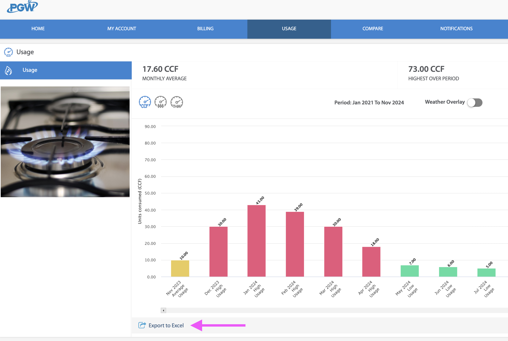

# Utilities

The Philadelphia electrical, natural gas, and water utilities websites each
allow for a residential account holder to access (and export!) their own usage
data.

## Electric
### Pennsylvania Electric Company ("PECO")
A ZIP (`.zip`) archive containing a comma-separated values (`.csv`) file, of
electricity used in kilowatt-hours (kWh), can be downloaded from the
"[My Green Button Data](https://secure.peco.com/MyAccount/MyBillUsage/Pages/Secure/GreenButtonConnectDownloadMyData.aspx)"
page of the "My Usage" section of the PECO website:


The export CSV file from PECO is named based upon the dates exported, like so:
> `peco_electric_usage_interval_data_Service 1_1_2023-07-04_to_2023-07-04.csv`

The PECO file begins with a header that includes account information:
> ```
> Name,WILLIAM PENN
> Address,"1 S BROAD ST, PHILADELPHIA PA 19112"
> Account Number,1776xxxxxx
> Service,Service 1
> ```

Each row of the PECO CSV export file has kilowatt-hours (kWh) of electricity
used, as well as the start and end of the hour measured:
> ```
> TYPE,DATE,START TIME,END TIME,USAGE (kWh),NOTES
> Electric usage,2023-07-04,00:00,00:59,0.29
> Electric usage,2023-07-04,01:00,01:59,0.34
> Electric usage,2023-07-04,02:00,02:59,0.34
> Electric usage,2023-07-04,03:00,03:59,0.32
> ```

The `electric_fill` Django management command imports this file into the database:
> ```
> $ python3 manage.py electric_fill
> TODO: Output Example
> Done.
> ```

The `electric_weekend` Django management command does some calculations based
upon the data to compare electric usage on weekdays vs. weekends:
> ```
> $ python3 manage.py electric_weekend             
> From:           Sun Jan 22 04:00:00 2023 (2023-01-22 04:00:00+00:00)
> To:             Mon Dec 16 04:00:00 2024 (2024-12-16 04:00:00+00:00)
> Weekdays:       7,694.1700 total kWh / 11,885 total hours = average 0.6474 kWh.
> Weekends:       3,549.1300 total kWh / 4,770 total hours = average 0.7441 kWh.
> Total:          11,243.3000 kWh / 16,655 hours = average 0.6751 kWh.
> ```

## (Natural) Gas
### Philadelphia Gas Works ("PGW")
An Excel (`.xlsx`) spreadsheet file of natural gas, used in hundreds of cubic
feet (CCF), each (billing) month can be downloaded from the
"[usage section](https://myaccount.pgworks.com/portal/usages.aspx?type=GU)"
of the Philadelphia Gas Works (PGW) website;


The Excel spreadsheet from PGW is named by the date it was exported
(such as `UsageDataMMDDYYYY.xlsx`):
> `UsageData12142024.xlsx`

The PGW file also begins with a header that includes account information:
> ```
> Service Point Number: 1776xxxxxx            
> Period: Jan 2021 To Jun 2021            
> Property: 1 S BROAD ST (xxxxx1776)
> ```

Each row of the PGW file includes hundreds of cubic feet (CCF) of natural gas
used each billing month:
> ```
> Bill Month    Units Consumed (CCF)    Period Start    Period End
> Jan, 2021     50.00                   12/18/20        01/21/21
> Feb, 2021     73.00                   01/21/21        02/22/21
> Mar, 2021     45.00                   02/22/21        03/22/21
> Apr, 2021     17.00                   03/22/21        04/21/21
> May, 2021     10.00                   04/21/21        05/20/21
> Jun, 2021     5.0                     05/20/21        06/18/21
> ```

The `gas_fill` Django management command imports this file into the database:
> ```
> $ python3 manage.py gas_fill
> TODO: Output Example
> Done.
> ```

## Water
#### Philadelphia Water Department ("PWD")
Comma-separated values ("CSV" / `.csv`) file of water used, in gallons, daily.

A CSV file can be downloaded by "Gallons" of water used "Daily" from the
"[Detailed Usage](https://secure8.i-doxs.net/CityOfPhiladelphiaWRB/Secure/Usage.aspx)"
section of the Philadelphia Water Department (PWD) website:


The water usage export `.csv` file is always named `ChartData.csv`.

Each row of the PWD file includes the number of gallons of water used each day:
> ```
> Access Code, Time Interval, Consumption, Units
> 00145xxxx, 11/27/2024, 18.7013, Gallons
> 00145xxxx, 11/28/2024, 35.9065, Gallons
> 00145xxxx, 11/29/2024, 35.1584, Gallons
> 00145xxxx, 11/30/2024, 44.8831, Gallons
> 00145xxxx, 12/01/2024, 71.8130, Gallons
> 00145xxxx, 12/02/2024, 25.4338, Gallons
> 00145xxxx, 12/03/2024, 23.9377, Gallons
> ```

The `water_fill` Django management command imports this file into the database:
> ```
> $ python3 manage.py water_fill
> Created:        Monday, December 16, 2024 (2024-12-16) [80.7896 gallons]
> Total:          1
> Done.
> ```

The `water_weekend` Django management command does some calculations based
upon the data to compare water usage on weekdays vs. weekends:
> ```
> $ python3 manage.py water_weekend   
> From:           Thursday, September 15, 2022 (2022-09-15)
> To:             Monday, December 16, 2024 (2024-12-16)
> Weekdays:       19,604.9468 gallons / 586 week days = average 33.4555 gallons.
> Weekends:       13,288.3955 gallons / 233 weekend days = average 57.0317 gallons.
> Total:          32,893.3423 gallons / 819 days = average 40.1628 gallons.
> ```

## API
Highcharts and DataTables are displayed using the JSON data from Django REST
Framework endpoints for each data set:
- Electric: [`https://utilities.ericoc.com/api/electric/`](https://utilities.ericoc.com/api/electric/)
- (Natural) Gas: [`https://utilities.ericoc.com/api/gas/`](https://utilities.ericoc.com/api/gas/)
- Water: [`https://utilities.ericoc.com/api/water/`](https://utilities.ericoc.com/api/water/)
