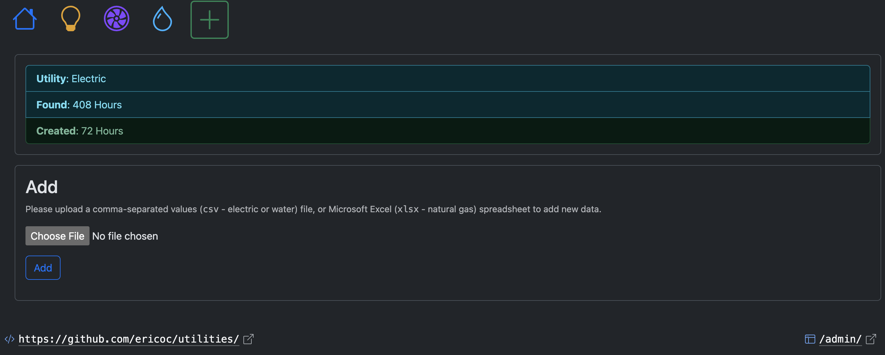

# Utilities

The Philadelphia electrical, natural gas, and water utilities websites each
allow for a residential account holder to access (and export!) their own usage
data.

This Django web application imports utility usage data.
The data is then displayed with HighCharts and DataTables.

The website is publicly available online at:
#### https://utilities.ericoc.com/


## Adding Data
New data can be added (_by staff_) one of two ways:
- Upload a file of usage data generated by one of the utility companies:
- Manually using the appropriate Django management commands documented below.

### Uploads
- The `/add/` view allows an authenticated staff user to upload a file of usage data.
- Uploads are processed and any new data is inserted/updated to the appropriate model.



### Management Commands
There are also Django management commands to import each utility file:
- `electric_fill`
- `natural_gas_fill`
- `water_fill`

Examples of each of these management commands, including output, is below per utility.

## Electric
### Pennsylvania Electric Company ("PECO")


A ZIP (`.zip`) archive containing a comma-separated values (`.csv`) file, of
electricity used in kilowatt-hours (kWh), can be downloaded from the
"[My Green Button Data](https://secure.peco.com/MyAccount/MyBillUsage/Pages/Secure/GreenButtonConnectDownloadMyData.aspx)"
page of the "My Usage" section of the PECO website:


The export CSV file from PECO is named based upon the dates exported, like so:
> `peco_electric_usage_interval_data_Service 1_1_2023-07-04_to_2023-07-04.csv`

The PECO file begins with a header that includes account information:
```
Name,WILLIAM PENN
Address,"1 S BROAD ST, PHILADELPHIA PA 19112"
Account Number,1776xxxxxx
Service,Service 1
```

Each row of the PECO CSV export file has kilowatt-hours (kWh) of electricity
used, as well as the start and end of the hour measured:
```
TYPE,DATE,START TIME,END TIME,USAGE (kWh),NOTES
...
Electric usage,2024-12-17,18:00,18:59,0.46
Electric usage,2024-12-17,19:00,19:59,0.44
Electric usage,2024-12-17,20:00,20:59,0.41
Electric usage,2024-12-17,21:00,21:59,0.51
Electric usage,2024-12-17,22:00,22:59,1.08
Electric usage,2024-12-17,23:00,23:59,2.92
```

The `electric_fill` Django management command imports this file into the database:
```python
$ python3 manage.py electric_fill
1 CSV file(s) found.
...
Created:    Tuesday, December 17, 2024 @ 06 PM (2024-12-17 18:00:00-05:00) [0.46 kWh]
Created:    Tuesday, December 17, 2024 @ 07 PM (2024-12-17 19:00:00-05:00) [0.44 kWh]
Created:    Tuesday, December 17, 2024 @ 08 PM (2024-12-17 20:00:00-05:00) [0.41 kWh]
Created:    Tuesday, December 17, 2024 @ 09 PM (2024-12-17 21:00:00-05:00) [0.51 kWh]
Created:    Tuesday, December 17, 2024 @ 10 PM (2024-12-17 22:00:00-05:00) [1.08 kWh]
Created:    Tuesday, December 17, 2024 @ 11 PM (2024-12-17 23:00:00-05:00) [2.92 kWh]
Total:      24
Done.
```

The `electric_weekend` Django management command compares electric usage on
weekdays vs. weekends:
```python
$ python3 manage.py electric_weekend
From:   Sat Jan 21 23:00:00 2023 (2023-01-21 23:00:00-05:00) [2 years, 2 months ago]
To:     Mon Apr 14 23:00:00 2025 (2025-04-14 23:00:00-04:00) [4 days, 20 hours ago]
Weekdays:       8,910.2900 total kWh / 13,944 total hours = average 0.6390 kWh over 1 year, 7 months.
Weekends:       3,966.6500 total kWh / 5,590 total hours = average 0.7096 kWh over 7 months, 2 weeks.
Total:  12,876.9400 kWh / 19,534 hours = average 0.6592 kWh over 2 years, 2 months.

```

## Natural Gas
### Philadelphia Gas Works ("PGW")


An Excel (`.xlsx`) spreadsheet file of natural gas, used in hundreds of cubic
feet (CCF), each (billing) month can be downloaded from the
"[usage section](https://myaccount.pgworks.com/portal/usages.aspx?type=GU)"
of the Philadelphia Gas Works (PGW) website;


The Excel spreadsheet from PGW is named by the date it was exported
(such as `UsageDataMMDDYYYY.xlsx`):
> `UsageData12142024.xlsx`

The PGW file also begins with a header that includes account information:
```
Service Point Number: 1776xxxxxx
Period: Jan 2021 To Jun 2021
Property: 1 S BROAD ST (xxxxx1776)
```

Each row of the PGW file includes hundreds of cubic feet (CCF) of natural gas
used each billing month:
```
Bill Month  Units Consumed (CCF)    Period Start    Period End
Jan, 2021   50.00                   12/18/20        01/21/21
Feb, 2021   73.00                   01/21/21        02/22/21
Mar, 2021   45.00                   02/22/21        03/22/21
Apr, 2021   17.00                   03/22/21        04/21/21
May, 2021   10.00                   04/21/21        05/20/21
Jun, 2021   5.0                     05/20/21        06/18/21
```

The `natural_gas_fill` Django management command imports this file into the database:
```python
$ python3 manage.py natural_gas_fill
1 spreadsheet(s) found.
...
Created:    March 2025 (2025-03-01) [33.0 CCF]
Total:  1
Done.
```


## Water
#### Philadelphia Water Department ("PWD")


Comma-separated values ("CSV" / `.csv`) file of water used, in gallons, daily.

A CSV file can be downloaded by "Gallons" of water used "Daily" from the
"[Detailed Usage](https://secure8.i-doxs.net/CityOfPhiladelphiaWRB/Secure/Usage.aspx)"
section of the Philadelphia Water Department (PWD) website:


The water usage export `.csv` file is always named `ChartData.csv`.

Each row of the PWD file includes the number of gallons of water used each day:

```
Access Code, Time Interval, Consumption, Units
00145xxxx, 11/27/2024, 18.7013, Gallons
00145xxxx, 11/28/2024, 35.9065, Gallons
00145xxxx, 11/29/2024, 35.1584, Gallons
00145xxxx, 11/30/2024, 44.8831, Gallons
00145xxxx, 12/01/2024, 71.8130, Gallons
00145xxxx, 12/02/2024, 25.4338, Gallons
00145xxxx, 12/03/2024, 23.9377, Gallons
```

The `water_fill` Django management command imports this file into the database:
```python
$ python3 manage.py water_fill
Created:    Wednesday, March 26, 2025 (2025-03-26) [18.7013 gallons]
Created:    Thursday, March 27, 2025 (2025-03-27) [23.1896 gallons]
Created:    Friday, March 28, 2025 (2025-03-28) [43.387 gallons]
Created:    Saturday, March 29, 2025 (2025-03-29) [35.9065 gallons]
Created:    Sunday, March 30, 2025 (2025-03-30) [35.1584 gallons]
Created:    Monday, March 31, 2025 (2025-03-31) [56.1039 gallons]
Total:  6
Done.
```

The `water_weekend` Django management command compares water usage on
weekdays vs. weekends:
```python
$ python3 manage.py water_weekend
From:   Thursday, September 15, 2022 (2022-09-15)
To:     Thursday, April 17, 2025 (2025-04-17)
Weekdays:       22,605.3836 gallons / 674 week days = average 33.5391 gallons over 1 year, 10 months.
Weekends:       14,608.7073 gallons / 267 weekend days = average 54.7143 gallons over 8 months, 3 weeks.
Total:  37,214.0909 gallons / 941 days = average 39.5474 gallons over 2 years, 6 months.
```

## API
Highcharts and DataTables are displayed using the JSON data from the
Django REST Framework API endpoint for each utility:
- Electric: [`https://utilities.ericoc.com/api/electric/`](https://utilities.ericoc.com/api/electric/)
- Natural Gas: [`https://utilities.ericoc.com/api/natural_gas/`](https://utilities.ericoc.com/api/natural_gas/)
- Water: [`https://utilities.ericoc.com/api/water/`](https://utilities.ericoc.com/api/water/)
